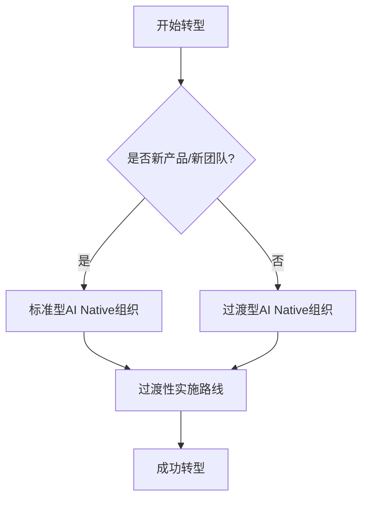

<!--
 * @Description: TODO
 * @Author: jett.gao jett@laien.io
 * @Date: 2025-12-16 10:12:32
 * @LastEditors: jett.gao jett@laien.io
 * @LastEditTime: 2025-12-17 17:34:05
 * Copyright (c) 2025 by laien.ltd. All Rights Reserved. 
-->
# 组织架构与工作流程转型

## 如何调整组织架构和工作流程以支持AI Native模式

本节详细介绍两种组织架构模型和具体的转型实施路线。

### 内容结构

## 组织架构模型对比

| 对比维度 | [标准型 AI Native 组织](standard-model/README.html) | [过渡型 AI Native 组织](transitional-model/README.html) |
|---------|------------------------------------------|------------------------------------------|
| **适用场景** | • 新产品开发 • 新团队组建 • 创业公司 | • 现有产品线 • 大型组织转型 • 传统团队升级 |
| **转型方式** | 完全 AI Native 的组织架构设计 | 现有组织的渐进式转型方案 |
| **团队规模** | ✅ 完全灵活，按需配置 | ⚠️ 双轨制：新产品标准模式 + 现有产品传统模式 |
| **核心角色** | ✅ Builder 为核心角色 | ⚠️ Builder 与传统角色并存 |
| **工作方式** | ✅ 端到端 PDCA 工作方式 | ⚠️ 逐步过渡到 PDCA 模式 |
| **实施难度** | ⭐⭐（从零开始，架构清晰） | ⭐⭐⭐⭐（需处理现有组织惯性） |
| **见效速度** | 快速（无历史包袱） | 渐进（需要过渡期） |
| **推荐指数** | ⭐⭐⭐⭐⭐（理想模式） | ⭐⭐⭐⭐（现实选择） |

## 转型实施路线

### [过渡性实施路线](transition-roadmap/README.html)

| 转型层面 | 核心内容 | 关键产出 |
|---------|---------|---------|
| **组织层面转型** | 如何调整组织架构 • 重新定义角色职责 • 调整汇报关系 • 优化决策流程 | ✅ 新组织架构图 ✅ 角色职责说明书 ✅ 决策流程文档 |
| **日常工作流程转型** | 如何改变日常工作方式 • Builder 工作模式 • AI 协作流程 • 沟通协作机制 | ✅ 工作流程手册 ✅ AI 工具使用指南 ✅ 协作规范 |
| **产品开发流程转型** | 7 步产品开发流程详解 数据分析 → Idea → 市场研究 → 竞品分析 → 需求 → UX设计 → 开发 | ✅ 产品开发 SOP ✅ 各阶段交付物模板 ✅ 质量检查清单 |

💡 **详细内容请查看**：[过渡性实施路线完整文档](transition-roadmap/README.html)

---

### 选择指南

---

_组织架构决定了转型的深度，工作流程决定了转型的质量。_
