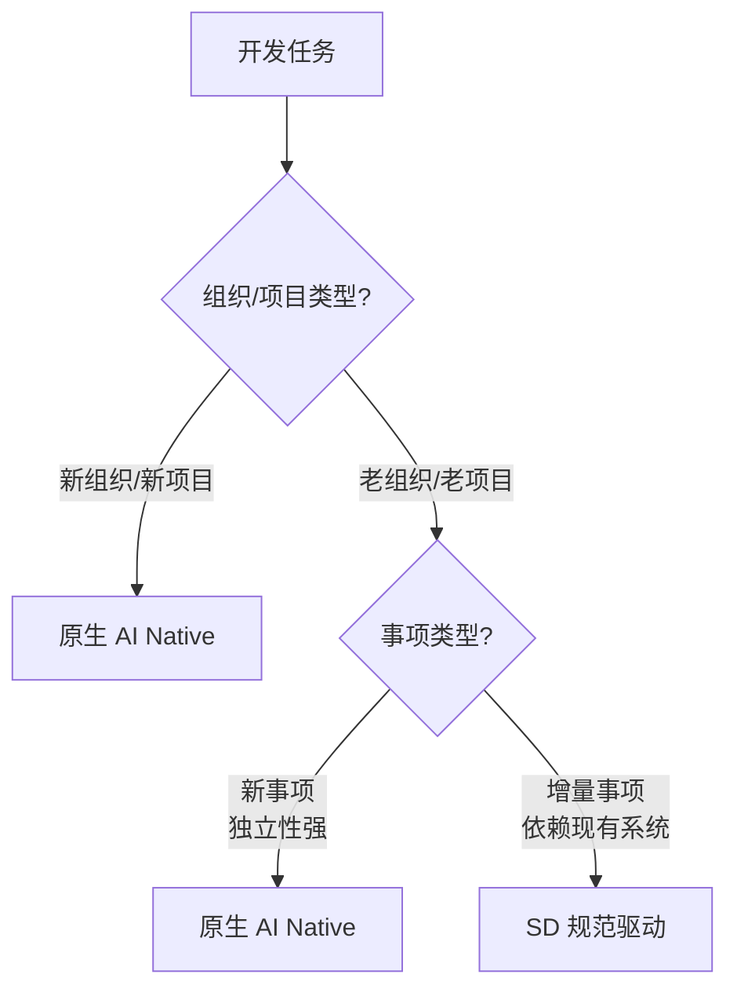

# 过渡型架构思考

> **核心**：不同组织和事项，采用不同策略。

---

## 核心思考一：新组织、新项目

### 使用原生 AI Native

| 维度 | 说明 |
|------|------|
| **什么是原生 AI Native** | 从第一天就按 AI Native 方式组织和开发： • Builder 端到端负责 • AI 作为核心协作伙伴 • 快速迭代验证 |
| **为什么适合** | ✅ **无历史包袱**：没有技术债务，没有组织惯性 ✅ **完全自由设计**：可以按最佳方式组织 ✅ **快速验证**：2-3 天完成 MVP，快速试错 |
| **核心特征** | • 扁平化组织 • Builder 中心 • 结果导向（PDCA 循环） |

---

## 核心思考二：老组织、老项目的双轨策略

### 策略选择表

| 事项类型 | 定义 | 采用策略 | 核心原因 | 示例 |
|---------|------|---------|---------|------|
| **新事项（结果）** | • 全新的功能模块 • 独立的业务线 • 创新性探索 | **原生 AI Native** | ✅ **独立性强**：可以独立设计和实现 ✅ **释放创造力**：AI 自主设计最佳方案 ✅ **快速验证**：快速实现 MVP，验证商业假设 | • 新增用户反馈系统 • 开发移动端 APP • 数据分析仪表板 |
| **增量事项（结果）** | • Bug 修复 • 性能优化 • 功能增强 | **SD（规范驱动）** | ✅ **需理解现有架构**：修改必须符合现有系统设计 ✅ **保持一致性**：不能引入不兼容的变化 ✅ **风险可控**：精确实现，减少对现有系统的影响 | • 修复登录超时问题 • 优化数据库查询性能 • 增强表单验证逻辑 |

### 快速决策流程

---

## 核心思考三：人与事的重新匹配

### 模式对比

| 维度 | 传统模式 | AI Native 模式 | 核心转变 |
|------|---------|--------------|---------|
| **维护性工作 （老事）** | 新人做 （学习成本高、效率低） | AI 做 （理解代码库强、执行高效） | 从"培养新人"到"AI 擅长" |
| **创新性工作 （新事）** | 老人做 （依赖经验积累） | Builder 做 （端到端负责、快速迭代） | 从"经验驱动"到"创造驱动" |

### 能力对比

| 能力维度 | AI 的优势 | AI 的局限 | Builder 的价值 |
|---------|----------|----------|---------------|
| **代码理解** | ✅ 理解现有代码库能力强 | ❌ 创新性思考能力有限 | ✅ 商业洞察：理解用户需求和商业价值 |
| **执行效率** | ✅ 执行规范和重复性工作效率高 | ❌ 商业判断和用户洞察不足 | ✅ 创新能力：提出新的解决方案 |
| **工作态度** | ✅ 不会厌倦枯燥的维护工作 | ❌ 跨领域综合决策能力弱 | ✅ 综合判断：权衡技术和业务因素 |

### 效率和质量对比

| 维度 | 传统模式 | AI Native 模式 | 提升幅度 |
|------|---------|--------------|---------|
| **创新性工作** | 老人（经验丰富） | Builder（端到端负责） | 质量更高、迭代更快 |
| **维护性工作** | 新人（学习成本） | AI（高效精准） | 3-5 倍效率提升 |
| **整体效率** | 中等 | 高 | 3-5 倍 |
| **质量保证** | 依赖个人能力 | AI 辅助 + Builder 把控 | 更稳定可靠 |

---

## 关键洞察

💡 **三句话总结**：

1. **新组织/新项目**直接采用原生 AI Native，无需妥协

2. **老组织/老项目**采用双轨策略：新事项用原生 AI Native，增量事项用 SD 规范驱动

3. **人与事重新匹配**：老事交给 AI 做（效率高），新事由 Builder 做（创造力强）

---

_过渡型架构的智慧：根据组织现状和事项特点，灵活选择最适合的策略。_
