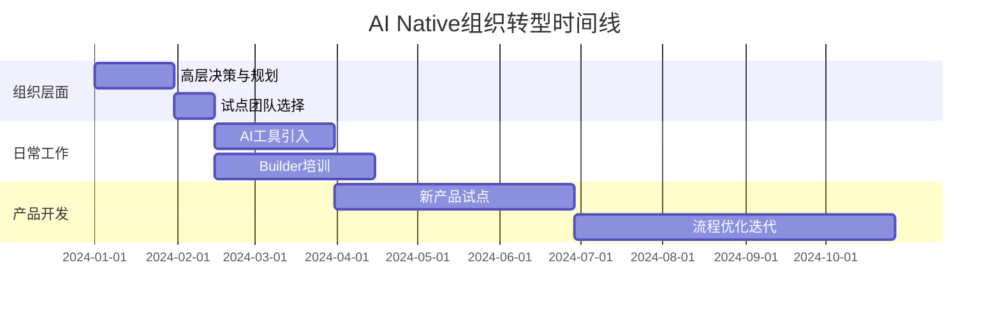

# 过渡性实施路线

## 组织转型的三个层面详细实施步骤

本节提供从组织层面到日常工作、再到产品开发的完整转型实施路线。

### 章节内容

## 三个转型层面

### [组织层面转型](organization-level.html)

如何在组织架构层面进行调整：
- 组织架构重组
- 角色职责重新定义
- KPI考核体系调整
- 资源分配机制改革

### [日常工作流程转型](daily-workflow.html)

如何改变日常工作方式：
- 会议和沟通模式
- 任务管理和协作方式
- AI工具的日常使用
- 端到端工作习惯养成

### [产品开发流程转型](product-development/README.html)

详细的7步AI Native产品开发流程：
1. [数据分析](product-development/1-data-analysis.html)
2. [Idea生成](product-development/2-idea-generation.html)
3. [市场研究](product-development/3-market-research.html)
4. [竞品分析](product-development/4-competitive-analysis.html)
5. [需求定义](product-development/5-requirements.html)
6. [UX设计](product-development/6-ux-design.html)
7. [开发实现](product-development/7-development.html)

### 转型实施时序

### 实施优先级

| 阶段 | 重点任务 | 预期成果 | 时间周期 |
|------|----------|----------|----------|
| **第一阶段** | 组织层面决策和试点选择 | 明确转型路径和资源投入 | 1-2个月 |
| **第二阶段** | 日常工作流程改造 | 团队熟悉AI工具和新流程 | 2-3个月 |
| **第三阶段** | 产品开发流程实践 | 完成首个AI Native产品 | 3-6个月 |
| **第四阶段** | 规模化推广 | 全组织采用AI Native模式 | 6-12个月 |

### 关键检查点

每个阶段结束时，需要检查：

✅ **组织层面：**
- 管理层是否充分理解和支持？
- 资源是否到位？
- 考核机制是否调整？

✅ **日常工作：**
- 团队是否适应新的工作方式？
- AI工具是否有效使用？
- 协作效率是否提升？

✅ **产品开发：**
- 产品质量是否达到预期？
- 开发效率是否提升？
- Builder能力是否成长？

---

_转型是系统工程，需要组织、流程、产品三个层面协同推进。_
