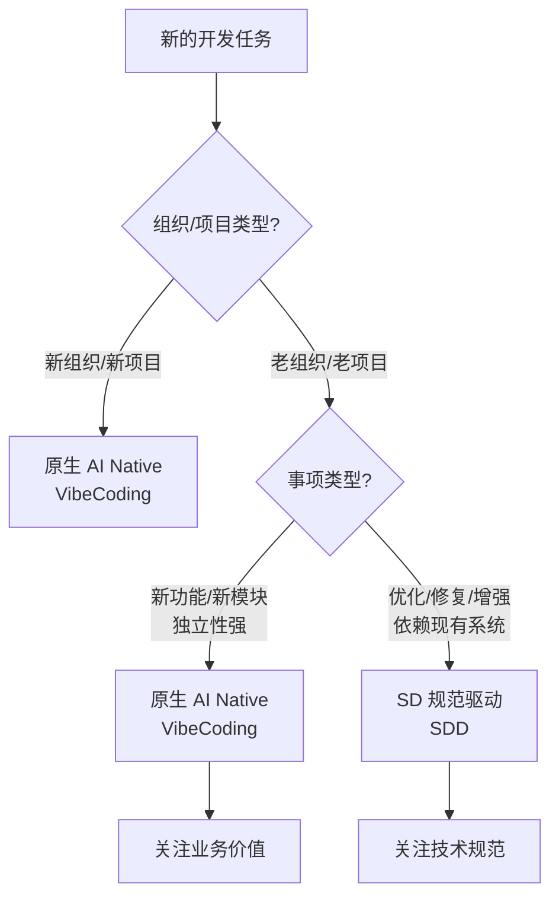

# 过渡型架构思考

## 核心思想

💡 **不同组织和事项类型，采用不同的开发策略** - 没有一刀切的方案，根据实际情况灵活选择 VibeCoding 或 SDD。

---

## 架构决策矩阵

| 组织/项目类型 | 事项类型 | 适用模式 | 开发方式 | 核心特点 | 典型场景 |
|-------------|---------|---------|---------|---------|---------|
| 🆕 **新组织、新项目** | 所有事项 | 原生 AI Native | VibeCoding | • 自然语言交互<br>• AI 自主执行<br>• 快速迭代验证 | • 创业公司产品开发<br>• 新业务线启动<br>• 独立项目孵化 |
| 🏢 **老组织、老项目** | 新事项<br>（新功能/新模块） | 原生 AI Native | VibeCoding | • 独立模块设计<br>• 关注业务价值<br>• 无历史包袱 | • 新增用户反馈系统<br>• 新支付模块<br>• 新数据分析功能 |
| 🏢 **老组织、老项目** | 增量性事项<br>（优化/修复/增强） | SD 规范驱动 | SDD | • 基于技术规范<br>• 理解现有架构<br>• 保持一致性 | • Bug 修复<br>• 性能优化<br>• 功能增强<br>• 代码重构 |

---

## VibeCoding vs SDD 详细对比

### 概念定义

**VibeCoding（AI Native 自然交互式开发）**：
- 通过自然语言与 AI 协作，AI 理解意图并自主完成开发
- 适合创新性、从 0 到 1 的场景
- Builder 关注结果和体验，AI 负责实现细节

**SDD（Specification-Driven Development 规范驱动开发）**：
- 基于详细技术规范和现有代码库上下文进行开发
- 适合在现有系统中的增量修改、优化、bug 修复等场景
- 需要精确理解现有架构

### 对比表格

| 对比维度 | VibeCoding（AI Native） | SDD（规范驱动） |
|---------|----------------------|---------------|
| **核心理念** | AI 理解意图，自主完成 | 基于规范和上下文，精确执行 |
| **交互方式** | 自然语言描述业务需求 | 详细技术规范 + 代码库上下文 |
| **AI 角色** | 创造者和执行者 | 精确的执行助手 |
| **Builder 关注** | 业务价值和用户体验 | 技术细节和架构一致性 |
| **适用场景** | 从 0 到 1 的创新 | 现有系统的改进 |
| **工作流程** | 需求 → AI 设计 → 快速迭代 | 分析 → 规范 → AI 实现 → 验证 |
| **成功关键** | 清晰的业务目标和验收标准 | 准确的规范和充分的上下文 |
| **典型产出** | 独立的新功能模块 | 优化的现有代码 |
| **风险点** | 可能与现有系统集成困难 | 规范不准确导致错误实现 |

---

## 从 VibeCoding 到 SDD 的思维转变

### 核心差异

```
VibeCoding（新事项）                   SDD（增量性事项）
     ↓                                      ↓
关注"做什么"（What）              关注"怎么做"（How）
     ↓                                      ↓
业务导向                               技术导向
     ↓                                      ↓
快速迭代验证                           精确实现规范
     ↓                                      ↓
AI 自主创造                            AI 辅助执行
```

### 四个思维转变要点

1. **从自由创造到约束执行**
   - VibeCoding：AI 自由发挥，创造最佳方案
   - SDD：AI 遵循现有架构，保持一致性

2. **从业务语言到技术语言**
   - VibeCoding：用业务需求描述目标
   - SDD：用技术规范描述实现细节

3. **从结果导向到过程控制**
   - VibeCoding：关注最终用户体验
   - SDD：关注代码质量和架构合理性

4. **从快速迭代到精确实现**
   - VibeCoding：快速试错，持续优化
   - SDD：一次准确，减少对现有系统的影响

---

## 事项分类决策树

### 决策流程



### 决策问题清单

**✅ 判断是否为新事项（使用 VibeCoding）：**
- 这是全新的功能模块吗？
- 可以独立设计和实现吗？
- 对现有代码库依赖程度低吗？

→ 如果以上都是"是"，使用 **VibeCoding**

**✅ 判断是否为增量性事项（使用 SDD）：**
- 需要修改现有代码吗？
- 需要深入理解现有架构吗？
- 需要保持与现有系统的一致性吗？

→ 如果以上都是"是"，使用 **SDD**

---

## 实施指南

### 新组织、新项目的实施策略

**核心原则**：
- ✅ 完全采用 AI Native 模式
- ✅ 无需妥协和过渡
- ✅ 从第一天就建立最佳实践

**实施步骤**：
1. 选择合适的 AI 工具（Cursor、Claude Code CLI）
2. 培养 Builder 思维（结果导向）
3. 建立 VibeCoding 工作流程
4. 快速迭代，持续优化

---

### 老组织、老项目的实施策略

**核心原则**：
- ✅ 区分事项类型，分别对待
- ✅ 新事项突破，增量事项稳健
- ✅ 逐步积累 AI Native 能力

#### 对于新事项（VibeCoding）

**实施步骤**：
1. 识别独立性强的新功能需求
2. 组建小型 Builder 团队试点
3. 采用 AI Native 方式快速开发
4. 验证效果，形成最佳实践

**示例**：
- ✅ 新增独立的用户反馈系统
- ✅ 开发新的支付模块
- ✅ 创建新的数据分析仪表板

#### 对于增量性事项（SDD）

**实施步骤**：
1. 建立详细的技术规范模板
2. 整理现有代码库上下文文档
3. 培训团队使用 AI 辅助规范执行
4. 严格代码审查，保持质量

**示例**：
- ✅ 修复登录流程的 bug
- ✅ 优化数据库查询性能
- ✅ 增强现有表单验证逻辑

---

## 成功标志和风险管理

### 成功标志

| 时间节点 | 新事项（VibeCoding） | 增量性事项（SDD） |
|---------|-------------------|----------------|
| **1-3 个月** | • 完成 1-2 个独立新功能<br>• Builder 掌握 VibeCoding | • 建立规范模板<br>• 完成现有代码库文档化 |
| **3-6 个月** | • 新功能开发效率提升 3-5 倍<br>• 团队形成 VibeCoding 最佳实践 | • AI 辅助修复 bug 准确率 > 90%<br>• 代码质量稳定提升 |
| **6-12 个月** | • 新功能全部采用 AI Native 模式<br>• 成为组织创新引擎 | • 增量开发效率提升 2-3 倍<br>• 技术债务持续下降 |

### 潜在风险和应对措施

| 风险 | 应对措施 |
|------|---------|
| ⚠️ 新事项与现有系统集成困难 | ✅ 提前规划集成点和接口设计 |
| ⚠️ 增量事项规范不准确 | ✅ 建立规范评审机制和模板库 |
| ⚠️ 团队思维转变困难 | ✅ 提供充分培训和实战指导 |
| ⚠️ 新老模式并存管理复杂 | ✅ 清晰的事项分类标准和决策流程 |

---

## 关键洞察

💡 **核心要点**：

1. **没有一刀切的方案** - 根据组织类型和事项类型灵活选择
2. **VibeCoding 释放创造力** - 新事项应充分发挥 AI 的创造潜力
3. **SDD 保障稳定性** - 增量事项需要规范和上下文的双重保障
4. **思维转变是关键** - Builder 需要掌握两种思维模式的切换
5. **过渡是常态** - 大多数组织会长期处于新老模式并存的状态

---

_过渡型架构不是妥协，而是智慧 - 在创新和稳定之间找到最佳平衡点。_
