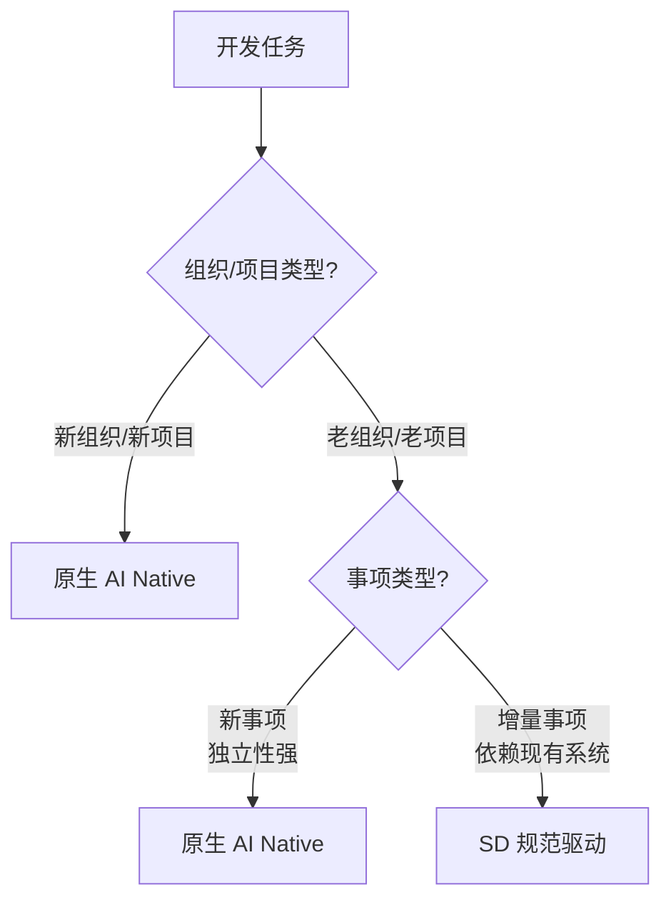

# AI Native 转型完整指南

_从理解到实践，从个人到组织，开启 AI Native 转型之旅_

---

## 一、转型背景：为什么要转型？

### 大模型的两大根本性突破

#### 1. 理解能力的突破

| 对比维度 | 传统 AI | 大模型 AI |
|---------|---------|----------|
| **上下文理解** | 无法处理复杂上下文 | ✅ 理解复杂业务背景和多轮对话 |
| **意图识别** | 需要预定义规则和精确指令 | ✅ 理解真实意图，无需精确指令 |
| **需求处理** | 无法理解模糊描述 | ✅ 处理不完整、不精确的需求 |
| **交互方式** | 需要结构化数据和专业术语 | ✅ 自然语言交互，大幅降低门槛 |

#### 2. 自主程度的突破

| 对比维度 | 传统 AI | 大模型 AI |
|---------|---------|----------|
| **执行方式** | 只能机械执行预设流程 | ✅ 自主分析、推理最优方案 |
| **异常处理** | 遇异常无法处理 | ✅ 自主判断和评估方案优劣 |
| **创造能力** | 缺乏推理和创造能力 | ✅ 生成新内容和创新方案 |
| **学习能力** | 固定逻辑，无法自我改进 | ✅ 从反馈中持续学习优化 |
| **自主程度** | 需要详细步骤指导 | ✅ 端到端自主完成复杂任务 |

### 核心转变：从"人适应 AI"到"AI 适应人"

| 对比维度 | 传统时代（人适应 AI） | 大模型时代（AI 适应人） |
|---------|------------------|-------------------|
| **使用方式** | 人必须学习编程语言和技术框架 | ✅ 用自然语言表达即可 |
| **指令要求** | 需要写精确指令 | ✅ AI 理解意图，自主推理执行 |
| **异常处理** | 手动处理异常 | ✅ AI 自主判断和处理边界情况 |
| **协作模式** | AI 是僵硬工具，被动执行 | ✅ AI 像团队成员，主动协作 |
| **使用门槛** | 极高，只有专业人士能用 | ✅ 大幅降低，普通人也能使用 |
| **能力范围** | 少数专业人士的工具 | ✅ 每个人的能力放大器 |

### Builder 角色成为可能

**为什么以前没有 Builder？**

| 能力维度 | 传统模式的限制 | AI 赋能的新可能 |
|---------|--------------|---------------|
| **专业能力** | 必须专精单一领域 | ✅ AI 智能体团队提供多领域专业支持 |
| **协作模式** | 严重依赖团队协作 | ✅ Builder + AI 智能体端到端独立完成 |
| **学习能力** | 工具使用门槛高，需长期积累 | ✅ AI 协助快速掌握新领域，达到 60-80 分水平 |
| **责任范围** | 个人能力有限，无法端到端负责 | ✅ 可对完整业务结果负责，拥有全链路决策权 |
| **工作方式** | 职能分工，一人一环节，沟通成本高 | ✅ 像创业者一样端到端思考和执行 |

**Builder 可以做到**：
- ✅ 像**创业者**一样思考全局业务和商业价值
- ✅ 像**产品经理**一样定义有价值的解决方案
- ✅ 像**设计师**一样关注用户体验和视觉呈现
- ✅ 像**全栈工程师**一样实现技术方案
- ✅ 像**运营专家**一样优化业务流程和数据指标
- ✅ 💡 **最关键**：对完整业务结果端到端负责

---

## 二、转型时机：为什么必须是现在？

### 1. 技术成熟度达到临界点

- **模型能力**：GPT-4、Claude 3.5 Sonnet 等模型已达专业级水平
- **工具生态**：Cursor、Devin、Github Copilot 等工具链成熟
- **成本可控**：大模型 API 成本大幅降低，可商业化使用
- **稳定性提升**：模型输出质量稳定，可用于生产环境

### 2. 市场竞争加剧

- **效率差距扩大**：AI Native 组织效率是传统组织的 5-10 倍
- **成本优势明显**：小团队可以完成大团队的工作
- **创新速度加快**：快速迭代成为竞争关键
- **人才竞争白热化**：顶尖人才稀缺且昂贵

### 3. 组织转型窗口期

- **传统模式僵化**：大组织层级复杂，转型困难
- **新兴企业机会**：小团队通过 AI Native 模式实现弯道超车
- **认知差距**：早期采用者获得先发优势
- **技术代际更替**：新一代技术人员原生掌握 AI 协作

💡 **关键洞察**：
- 理解能力 + 自主程度 = AI 从"工具"升级为"团队成员"
- AI 适应人 而非 人适应 AI = 能力民主化的关键
- Builder 角色的出现 = 组织能力范式的根本性转变
- **现在是最佳时机** = 技术成熟 × 市场需求 × 竞争压力

---

## 三、转型策略：怎么做？

### 核心思考：不同组织和事项，采用不同策略

#### 1. 新组织、新项目 → 原生 AI Native

| 维度 | 说明 |
|------|------|
| **什么是原生 AI Native** | 从第一天就按 AI Native 方式组织和开发：<br>• Builder 端到端负责<br>• AI 作为核心协作伙伴<br>• 快速迭代验证 |
| **为什么适合** | ✅ **无历史包袱**：没有技术债务，没有组织惯性<br>✅ **完全自由设计**：可以按最佳方式组织<br>✅ **快速验证**：2-3 天完成 MVP，快速试错 |
| **核心特征** | • 扁平化组织<br>• Builder 中心<br>• 结果导向（PDCA 循环） |

#### 2. 老组织、老项目 → 双轨策略

| 事项类型 | 定义 | 采用策略 | 核心原因 |
|---------|------|---------|---------|
| **新事项（结果）** | • 全新功能模块<br>• 独立业务线<br>• 创新性探索 | **原生 AI Native** | ✅ **独立性强**：可以独立设计实现<br>✅ **释放创造力**：AI 自主设计最佳方案<br>✅ **快速验证**：快速实现 MVP |
| **增量事项（结果）** | • Bug 修复<br>• 性能优化<br>• 功能增强 | **SD（规范驱动）** | ✅ **需理解现有架构**：修改必须符合现有设计<br>✅ **保持一致性**：不能引入不兼容变化<br>✅ **风险可控**：精确实现，减少影响 |

#### 快速决策流程



#### 3. 人与事的重新匹配

| 维度 | 传统模式 | AI Native 模式 | 核心转变 |
|------|---------|---------------|---------|
| **维护性工作（老事）** | 新人做<br>（学习成本高、效率低） | AI 做<br>（理解代码库强、执行高效） | 从"培养新人"到"AI 擅长" |
| **创新性工作（新事）** | 老人做<br>（依赖经验积累） | Builder 做<br>（端到端负责、快速迭代） | 从"经验驱动"到"创造驱动" |

**能力与效率对比**：

| 能力维度 | AI 的优势 | Builder 的价值 |
|---------|----------|---------------|
| **代码理解** | ✅ 理解现有代码库能力强 | ✅ 商业洞察：理解用户需求和商业价值 |
| **执行效率** | ✅ 执行规范和重复性工作效率高 | ✅ 创新能力：提出新的解决方案 |
| **工作态度** | ✅ 不会厌倦枯燥的维护工作 | ✅ 综合判断：权衡技术和业务因素 |

**效率提升**：
- 创新性工作：Builder（端到端负责）→ 质量更高、迭代更快
- 维护性工作：AI（高效精准）→ 3-5 倍效率提升
- 整体效率：3-5 倍提升，质量更稳定可靠

---

## 四、转型路径：如何实施？

### 三层转型路径

| 转型层面 | 关键行动 | 预期周期 | 成功标志 | 常见挑战 |
|---------|---------|---------|---------|---------|
| 🧑 **个人层面** | 1. 学习 AI 协作工具（Cursor + CLI）<br>2. 实践端到端项目（内部工具）<br>3. 培养结果导向思维<br>4. 掌握 BMAD-METHOD 方法论 | 2-3 个月 | • 能独立完成中型项目<br>• 效率提升 3-5 倍<br>• 端到端交付能力 | • 工具学习曲线<br>• 思维模式转变<br>• 打破职能分工惯性 |
| 👥 **团队层面** | 1. 选择试点项目验证可行性<br>2. 组建 Builder 核心小组<br>3. 重组专业支持团队<br>4. 优化工作流程和激励机制 | 3-6 个月 | • 试点项目成功交付<br>• 团队效率提升 3-4 倍<br>• 形成可复制模式 | • 团队协作模式调整<br>• 角色转换适应<br>• 文化冲突处理 |
| 🏢 **组织层面** | 1. 高层达成转型共识<br>2. 制定转型路线图<br>3. 扁平化组织架构<br>4. 建立 AI Native 文化 | 6-12 个月 | • 组织架构扁平化<br>• 整体效能提升 4-5 倍<br>• AI Native 文化建立 | • 利益重新分配<br>• 变革阻力克服<br>• 人员转型或调整 |

### 转型层面的递进关系

```
个人能力建设 → 培养 2-3 名合格 Builder
    ↓
团队模式验证 → 试点项目成功，形成最佳实践
    ↓
组织架构转型 → 推广到全组织，重构组织架构
```

---

## 五、关键洞察总结

### 三句话总结转型策略

1. **新组织/新项目**直接采用原生 AI Native，无需妥协

2. **老组织/老项目**采用双轨策略：新事项用原生 AI Native，增量事项用 SD 规范驱动

3. **人与事重新匹配**：老事交给 AI 做（效率高），新事由 Builder 做（创造力强）

### 核心观点

💡 **理解能力 + 自主程度** = AI 从"工具"升级为"团队成员"

💡 **AI 适应人** 而非 **人适应 AI** = 能力民主化的关键

💡 **Builder 角色的出现** = 组织能力范式的根本性转变

💡 **现在是最佳时机** = 技术成熟 × 市场需求 × 竞争压力

💡 **转型不是一蹴而就的** = 需要时间、耐心和持续努力

💡 **窗口期有限** = 早期采用者将获得先发优势和竞争壁垒

### 最后的呼吁

_历史证明，每一次技术拐点都会重构商业格局。那些率先拥抱新范式的组织，往往会成为下一个时代的领导者。_

_AI Native 不是未来，而是现在。错过这个窗口期，可能意味着错过整个时代。_

_转型不是一蹴而就的，需要时间、耐心和持续的努力。但一旦成功，你将拥有远超传统组织的竞争力。现在就是最佳时机，不要错过这个历史性的窗口期。_

---

_💡 从理解到实践，从个人到组织，开启 AI Native 转型之旅_
