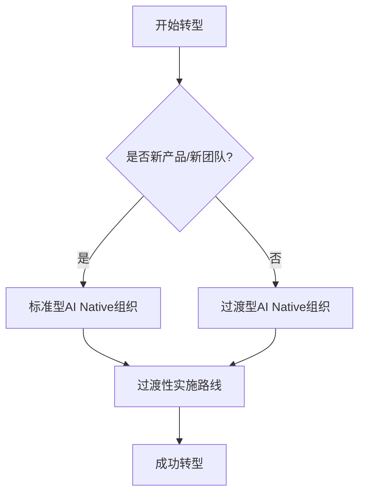

# 5.1 组织架构与工作流程转型

## 如何调整组织架构和工作流程以支持AI Native模式

本节详细介绍两种组织架构模型和具体的转型实施路线。

### 内容结构

## 组织架构模型

### [标准型AI Native组织](standard-model/README.md)

完全AI Native的组织架构设计，适用于：
- 新产品开发
- 新团队组建
- 创业公司

**核心特点**：
- 团队规模完全灵活
- Builder为核心角色
- 端到端PDCA工作方式

### [过渡型AI Native组织](transitional-model/README.md)

现有组织的渐进式转型方案，适用于：
- 现有产品线
- 大型组织转型
- 传统团队升级

**核心策略**：
- 新产品：完全标准模式
- 现有产品：双轨制运行

## 转型实施路线

### [过渡性实施路线](transition-roadmap/README.md)

三个层面的详细转型步骤：

1. **组织层面转型** - 如何调整组织架构
2. **日常工作流程转型** - 如何改变日常工作方式
3. **产品开发流程转型** - 7步产品开发流程详解
   - 数据分析 → Idea → 市场研究 → 竞品分析 → 需求 → UX设计 → 开发

---

### 选择指南

---

_组织架构决定了转型的深度，工作流程决定了转型的质量。_
