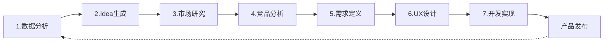

# 产品开发流程转型

## AI Native 产品开发 7 步流程详解

本节详细介绍AI Native模式下的完整产品开发流程，从数据分析到开发实现的每个环节。

### 7步流程概览

AI Native产品开发采用**数据驱动、AI协作、快速迭代**的方式，将传统需要多个角色分工的流程整合为Builder+AI可以端到端完成的流程。

### 详细步骤

#### [Step 1: 数据分析](1-data-analysis.md)
**目标**：通过数据洞察发现产品机会

- 用户行为数据分析
- 市场趋势数据研究
- AI辅助数据可视化和洞察提取
- 确定产品方向假设

**AI协作点**：数据清洗、可视化、模式识别

---

#### [Step 2: Idea 生成](2-idea-generation.md)
**目标**：基于数据洞察生成产品创意

- 头脑风暴与AI共创
- 创意评估和筛选
- 初步价值主张定义
- 可行性初判

**AI协作点**：创意激发、多维度评估、可行性分析

---

#### [Step 3: 市场研究](3-market-research.md)
**目标**：验证市场需求和规模

- TAM/SAM/SOM分析
- 目标用户画像
- 市场趋势研究
- 进入时机判断

**AI协作点**：市场数据收集、竞争格局分析、趋势预测

---

#### [Step 4: 竞品分析](4-competitive-analysis.md)
**目标**：了解竞争态势，定义差异化

- 主要竞品功能拆解
- 用户评价分析
- 差异化定位
- 竞争策略制定

**AI协作点**：竞品信息收集、用户评论情感分析、差异点挖掘

---

#### [Step 5: 需求定义](5-requirements.md)
**目标**：明确产品需求和优先级

- 用户故事编写
- 功能需求列表
- 优先级排序（MoSCoW）
- 验收标准定义

**AI协作点**：需求文档生成、用户故事编写、优先级建议

---

#### [Step 6: UX设计](6-ux-design.md)
**目标**：设计用户体验和界面

- 信息架构设计
- 用户流程图
- 线框图和原型
- 视觉设计

**AI协作点**：原型快速生成、设计规范应用、可用性测试

---

#### [Step 7: 开发实现](7-development.md)
**目标**：高质量快速开发和发布

- 技术架构设计
- 代码开发（AI结对编程）
- 测试和质量保障
- 部署和发布

**AI协作点**：代码生成、测试用例生成、代码审查、文档生成

---

### 流程特点

传统产品开发 vs AI Native产品开发：

| 维度 | 传统模式 | AI Native模式 |
|------|----------|---------------|
| **角色** | 产品经理、设计师、开发工程师、测试工程师等多角色 | Builder + AI（端到端） |
| **周期** | 数周到数月 | 数天到数周 |
| **协作方式** | 跨团队沟通和交接 | Builder与AI实时协作 |
| **文档** | 大量文档和评审 | 轻量级文档，AI辅助生成 |
| **迭代速度** | 较慢（跨团队协调） | 快速（端到端负责） |
| **质量** | 依赖流程和审核 | Builder+AI（60-80分）+ 专业团队（90-100分） |

### 关键成功因素

1. **Builder能力**：需要具备全栈视野和快速学习能力
2. **AI工具熟练度**：高效使用各类AI工具
3. **BMAD-METHOD**：使用系统化的AI协作方法论
4. **专业团队支持**：关键环节有专业团队把关

### 实践建议

💡 **入门建议：**
- 先从简单产品开始练习
- 重点掌握Step 5-7（需求、设计、开发）
- 逐步扩展到前期的数据分析和研究

💡 **进阶建议：**
- 建立个人的AI协作工作流
- 积累各步骤的Prompt模板库
- 持续优化和迭代流程

---

_7步流程不是严格的瀑布式，而是快速迭代的循环。重点是Builder通过AI协作实现端到端能力。_
