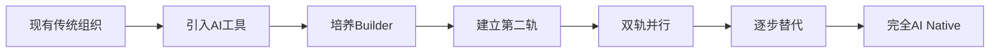

# 过渡型 AI Native 组织

## 现有组织的渐进式转型方案

过渡型AI Native组织是为现有组织设计的渐进式转型方案，通过"双轨制"实现平滑过渡。

### 章节内容

- [新产品策略](new-products.html) - 新产品采用完全标准模式
- [现有产品策略](existing-products.html) - 现有产品的双轨制转型

### 双轨制核心策略

```
过渡型AI Native组织 = 新产品（标准模式） + 现有产品（双轨制）
```

#### 新产品：完全标准模式

新产品和新团队**直接采用标准型AI Native组织模式**：
- 从一开始就按AI Native方式组建
- 无历史包袱，转型成本最低
- 可作为内部标杆和学习对象

#### 现有产品：双轨制运行

现有产品采用**渐进式双轨制转型**：
- **第一轨**：保持现有团队和流程（稳定运营）
- **第二轨**：引入Builder+AI模式（逐步替代）
- **最终目标**：第二轨完全替代第一轨

### 转型路径



### 关键成功因素

1. **高层支持**：需要管理层明确支持和资源投入
2. **试点先行**：选择1-2个产品/团队作为试点
3. **培养Builder**：投资于现有人员的能力提升
4. **文化变革**：从流程驱动到结果驱动的文化转变
5. **耐心与坚持**：转型需要时间，避免急于求成

### 风险管理

⚠️ **潜在风险：**
- 双轨制可能导致内部竞争和文化冲突
- 现有团队可能抵触变革
- 短期内成本可能上升

✅ **应对措施：**
- 明确沟通转型目标和价值
- 提供充分的培训和支持
- 设置清晰的转型里程碑
- 及时庆祝转型成果

---

_过渡型是大多数组织的现实选择，关键是坚定方向，稳步推进。_
