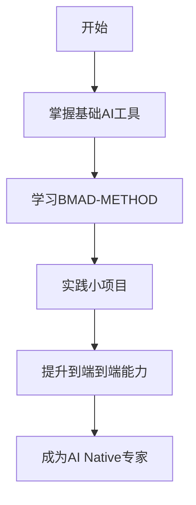

# 5.2 核心实践方法论

## 如何最大化与 AI 协作产出高质量成果

本节提供系统化的AI协作方法论和实践指南，帮助Builder快速提升AI协作能力。

### 章节内容

## [BMAD-METHOD 详解](bmad-method/README.md)

AI协作的系统化方法论，包含：

- [什么是BMAD-METHOD](bmad-method/README.md) - 核心概念和价值
- [核心特点](bmad-method/core-features.md) - 四阶段、三轨道、专业分工
- [为什么能保证高质量](bmad-method/quality-guarantee.md) - 5点质量保障机制
- [如何使用](bmad-method/how-to-use.md) - 编程实践中的具体应用

### BMAD-METHOD 核心架构

```
BMAD-METHOD = 4个阶段 + 3条轨道 + 21个专业AI智能体 + 50+引导式工作流
```

**4个阶段**：
1. 头脑风暴与产品定义
2. 架构设计与技术选型
3. Epic分解与Story拆分
4. 迭代开发与质量保障

**3条轨道**：
- BMad Method（软件方法论）
- BMad Builder（智能体和工作流构建）
- Creative Intelligence System（创意智能系统）

## [Builder 能力培养路径](builder-growth-path.md)

从入门到精通的5个Level成长路径：

- **Level 1**：AI工具使用者
- **Level 2**：AI协作初学者
- **Level 3**：AI协作熟练者
- **Level 4**：端到端Builder
- **Level 5**：AI Native专家

每个Level包含：
- 能力要求
- 学习路径
- 实践项目
- 进阶标准

## [工具栈指南](tool-stack-guide.md)

分层次的AI工具栈推荐：

- **基础层**：Claude、ChatGPT、Cursor等通用AI工具
- **进阶层**：Devin、Github Copilot、专业领域AI工具
- **管理层**：Linear、Slack、Notion等协作管理工具
- **框架层**：BMAD-METHOD等系统化方法论

---

### 核心实践原则

1. **系统化而非碎片化**：使用BMAD-METHOD等系统化方法，而非零散使用AI工具
2. **端到端能力培养**：不只是代码，要覆盖产品全生命周期
3. **质量优先**：60-80分的Builder+AI成果 + 专业团队优化到90-100分
4. **持续学习**：AI技术快速发展，需要保持学习和适应能力

### 学习路径建议



**时间估算**：
- Level 1 → Level 2：1-2个月
- Level 2 → Level 3：3-6个月
- Level 3 → Level 4：6-12个月
- Level 4 → Level 5：持续进化

---

_掌握核心实践方法论，是成为高效Builder的关键。BMAD-METHOD提供了经过验证的系统化路径。_
