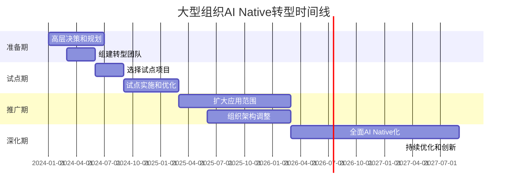

# 组织转型案例

## 传统大型组织的 AI Native 转型实践

本节收录传统大型组织向AI Native转型的案例，展示转型的路径、挑战和解决方案。

### 案例列表

## [Amazon](amazon.md)
**行业**：电商、云计算
**员工数**：150万+
**转型时间**：2018年至今
**AI投资**：每年数十亿美元

**关键洞察**：
- AI驱动的供应链优化
- Alexa语音助手的AI能力
- AWS AI服务的商业化
- 组织文化的持续进化

---

## [Moderna](moderna.md)
**行业**：生物科技
**员工数**：3000+
**转型时间**：2016年至今
**AI应用**：mRNA药物研发

**关键洞察**：
- AI加速新药研发（从年到月）
- 数据驱动的临床试验设计
- COVID-19疫苗的快速开发
- 科研与AI的深度融合

---

## [Bayer](bayer.md)
**行业**：制药、农业
**员工数**：10万+
**转型时间**：2019年至今
**AI投资**：年投入数亿欧元

**关键洞察**：
- 传统制药企业的数字化转型
- AI在药物发现中的应用
- 农业领域的AI解决方案
- 大型组织的变革管理

---

## [NVIDIA](nvidia.md)
**行业**：半导体、AI计算
**员工数**：2.6万+
**转型时间**：2015年至今
**市值增长**：从百亿到数万亿美元

**关键洞察**：
- 从GPU硬件到AI生态的转型
- AI基础设施的战略布局
- 开发者社区的建设
- 技术领先到平台领先

---

## 转型对比分析

| 公司 | 转型起点 | 转型策略 | 主要挑战 | 关键成果 |
|------|----------|----------|----------|----------|
| **Amazon** | 技术领先 | 全面AI化 | 规模化应用 | 行业标杆 |
| **Moderna** | 科研创新 | AI+mRNA | 监管合规 | 疫苗突破 |
| **Bayer** | 传统制药 | 双轨转型 | 文化变革 | 效率提升 |
| **NVIDIA** | 硬件优势 | 生态构建 | 市场教育 | 市值飙升 |

---

## 转型模式分类

### 模式1：全面转型（Amazon）
**特征**：
- 从上到下的全面AI化
- 大规模投资和人才引进
- 长期战略规划（5-10年）

**适用场景**：
- 技术基础好的公司
- 有充足资金支持
- CEO强力推动

---

### 模式2：聚焦突破（Moderna）
**特征**：
- 在核心业务领域深度应用AI
- 快速取得突破性成果
- 以成果推动更广泛应用

**适用场景**：
- 有明确AI应用场景
- 需要快速验证价值
- 资源相对有限

---

### 模式3：双轨并行（Bayer）
**特征**：
- 传统业务稳定运营
- 新业务AI Native
- 逐步扩大AI应用范围

**适用场景**：
- 传统行业转型
- 需要平衡稳定与创新
- 大型组织变革

---

### 模式4：生态重构（NVIDIA）
**特征**：
- 从产品到平台的转型
- 构建开发者生态
- 技术领先到标准制定

**适用场景**：
- 有技术优势的公司
- 希望构建行业标准
- 长期战略布局

---

## 共同挑战与解决方案

### 挑战1：文化变革
**问题**：传统组织文化与AI Native文化冲突

**解决方案**：
- 高层明确支持和示范
- 设立AI转型专项团队
- 建立新的考核机制
- 持续培训和沟通

**案例参考**：Amazon、Bayer

---

### 挑战2：人才缺口
**问题**：缺乏AI人才和Builder

**解决方案**：
- 外部招聘AI专家
- 内部培养Builder能力
- 与高校和研究机构合作
- 建立学习和成长机制

**案例参考**：Moderna、NVIDIA

---

### 挑战3：技术债务
**问题**：现有系统难以支持AI应用

**解决方案**：
- 逐步重构关键系统
- 建立数据中台
- 微服务化改造
- 云原生架构迁移

**案例参考**：Amazon、Bayer

---

### 挑战4：投资回报
**问题**：AI投资巨大，短期难见回报

**解决方案**：
- 选择高价值场景试点
- 设置阶段性里程碑
- 及时展示成果
- 建立长期投资预期

**案例参考**：Moderna（疫苗成功）、NVIDIA（市值增长）

---

## 转型时间线

典型的大型组织AI Native转型时间线：

**关键时间点**：
- **准备期**：6个月 - 高层决策和团队组建
- **试点期**：9个月 - 选择场景和验证价值
- **推广期**：12-18个月 - 扩大应用和组织调整
- **深化期**：18个月+ - 全面AI Native化和持续优化

---

## 成功因素

根据案例分析，成功转型需要：

### 1. 高层支持（必要条件）
- CEO/CTO的明确支持
- 充足的资源投入
- 长期战略规划

### 2. 试点成功（关键因素）
- 选择高价值场景
- 快速取得可见成果
- 建立信心和动力

### 3. 人才培养（持续动力）
- 外部引进+内部培养
- 建立学习和成长机制
- 形成AI人才梯队

### 4. 文化变革（根本保障）
- 从流程驱动到结果驱动
- 拥抱变化和快速迭代
- 建立容错和创新文化

### 5. 技术基础（支撑条件）
- 数据基础设施
- 云原生架构
- 微服务化改造

---

## 学习建议

**如果你在大型传统组织推动AI转型**：

1. **学习Amazon**：
   - 了解全面转型的路径和方法
   - 学习如何建立AI文化
   - 参考其组织架构调整

2. **学习Moderna**：
   - 了解如何在核心业务中深度应用AI
   - 学习如何快速取得突破性成果
   - 参考其科研与AI的融合模式

3. **学习Bayer**：
   - 了解双轨制转型的方法
   - 学习如何平衡稳定与创新
   - 参考其大型组织变革管理经验

4. **学习NVIDIA**：
   - 了解如何从产品到平台转型
   - 学习如何构建开发者生态
   - 参考其技术领先战略

---

_大型组织转型难度大，但成功后影响力更大。关键是选择合适的转型模式，坚定推进。_
