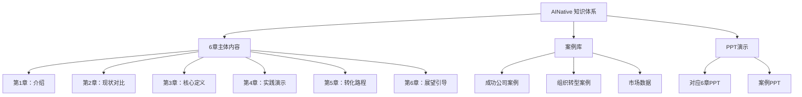

# AINative 项目信息架构设计 (Information Architecture)

_版本: v1.1 | 创建时间: 2025-12-16 | 最后更新: 2025-12-16 | 作者: Product Manager_

---

## 执行摘要

本文档详细定义了AINative项目的完整信息架构（IA），包括6章内容体系、案例库、以及PPT演示模式的完整结构设计。

**设计原则**：
- **6章完整框架**：严格遵循用户指定的6章结构
- **Doc↔PPT双模式**：支持文档模式和PPT演示模式无缝切换
- **模块化设计**：每个章节独立，便于维护和扩展
- **Kebab-case命名**：所有目录和文件使用英文kebab-case命名

---

## 1. 整体架构概览

### 1.1 顶层结构

```
docs/
├── 1-introduction/              # 第一章：介绍
├── 2-comparison/                # 第二章：现状对比
├── 3-core-definition/           # 第三章：核心定义
├── 4-practice-demo/             # 第四章：AI Native实践演示
├── 5-transition-practice/       # 第五章：过渡性转化路程实践
├── 6-outlook/                   # 第六章：AI Native展望
├── case-studies/                # 案例库（独立章节）
├── slides/                      # PPT演示模式
└── .vuepress/                   # VuePress配置
    ├── config.ts                # 导航和配置
    └── public/                  # 静态资源
        └── images/              # 图片资源
```

### 1.2 内容层级关系



---

## 2. 章节详细设计

### 第一章：介绍 (`1-introduction/`)

**目标**：通过开场Hook引发思考，建立核心认知

**文件结构**：
```
1-introduction/
├── README.md                           # 章节导航（开场Hook）
├── why-organizational-capability.md    # 为什么组织能力是壁垒
├── ai-native-brief.md                  # AI Native简述
└── simple-case-demo.md                 # AI Native简单案例演示
```

**内容要点**：
- **开场Hook**：组织能力才是公司真正的壁垒
  - 引发思考：什么决定了组织能力？
  - 引出问题：传统组织的能力边界在哪？
- **AI Native简述**：快速介绍AI Native的核心概念
- **简单案例演示**：通过具体案例展示AI Native的实际效果

---

### 第二章：现状对比 (`2-comparison/`)

**目标**：通过对比展示传统组织和AI Native组织的差异

**文件结构**：
```
2-comparison/
├── README.md                    # 章节导航和对比表
├── traditional-organization.md  # 传统组织：普通人构建的组织
└── ai-native-organization.md    # AI Native：顶尖科学家级别的组织
```

**内容要点**：
- 传统组织的特征和局限
- AI Native组织的特征和优势
- 核心对比维度（人员能力、组织方式、产出质量）

---

### 第三章：核心定义 (`3-core-definition/`)

**目标**：详细定义什么是AI Native

**文件结构**：
```
3-core-definition/
├── README.md                       # 章节导航和核心公式
├── builder-ai-team.md              # Builder + AI团队（60-80分）
├── professional-optimization.md    # 专业团队优化（90-100分）
├── digital-workforce.md            # 数字劳动力：Clone Builder思维
└── result-oriented-division.md     # 按结果分工，端到端负责
```

**内容要点**：
- **AI Native = Builder + AI（60-80分） + 专业团队优化（90-100分）**
  - Builder + AI团队：目标是完整实现，可以是MVP版本、MVP功能或基本实现（60-80分）
  - 专业团队优化：打造成完美、高质量的结果（90-100分）
- **数字劳动力**：新兴的AI Clone技术
  - Clone当前Builder的思维、SOP等特性
  - 持续进化，将Builder的工作量越来越少
  - 形成可复制的个性化高质量拟人劳动力
  - 减轻人员离职风险
  - 参考产品：yoolee.cn、viven.ai
- **按结果分工，端到端负责**：一个Builder完成整条链路，并可持续PDCA

---

### 第四章：AI Native实践演示 (`4-practice-demo/`)

**目标**：通过实际操作演示展示AI Native工作方式

**文件结构**：
```
4-practice-demo/
├── README.md                   # 演示概述
├── demo-overview.md            # 演示目标和整体流程
├── toolchain-setup.md          # Linear、Slack、Github、Devin配置
├── workflow-demonstration.md   # 完整工作流程演示
└── reference.md                # 参考资源（播客链接等）
```

**内容要点**：
- 桌面操作演示说明
- Linear任务管理
- Slack协作沟通
- Github代码管理
- Devin等智能体使用
- 一个Builder完成一个产品的完整流程
- 参考播客：https://www.xiaoyuzhoufm.com/episode/68ccfa75a56ca3e0c438706c

---

### 第五章：过渡性转化路程实践 (`5-transition-practice/`)

**目标**：提供详细的转型路径和实践方法论

**文件结构**：
```
5-transition-practice/
├── README.md                               # 章节总览
│
├── 5-1-organization-architecture/          # 组织架构与工作流程转型
│   ├── README.md                           # 导航
│   │
│   ├── standard-model/                     # 标准型AI Native组织
│   │   ├── README.md                       # 标准型概述
│   │   ├── core-principles.md              # 核心原则
│   │   ├── team-scale.md                   # 团队规模（完全灵活）
│   │   ├── role-definition.md              # 角色定义（Builder核心）
│   │   └── work-style.md                   # 工作方式（端到端、PDCA）
│   │
│   ├── transitional-model/                 # 过渡型AI Native组织
│   │   ├── README.md                       # 过渡型概述
│   │   ├── new-products.md                 # 新产品（完全标准模式）
│   │   └── existing-products.md            # 现有产品（双轨制）
│   │
│   └── transition-roadmap/                 # 过渡性实施路线
│       ├── README.md                       # 实施路线概述
│       ├── organization-level.md           # 组织层面转型步骤
│       ├── daily-workflow.md               # 日常工作流程转型
│       └── product-development/            # 产品开发流程转型（7步详解）
│           ├── README.md                   # 7步流程概述
│           ├── 1-data-analysis.md          # 数据分析
│           ├── 2-idea-generation.md        # Idea生成
│           ├── 3-market-research.md        # 市场研究
│           ├── 4-competitive-analysis.md   # 竞品分析
│           ├── 5-requirements.md           # 需求定义
│           ├── 6-ux-design.md              # UX设计
│           └── 7-development.md            # 开发实现
│
└── 5-2-core-practices/                     # 5.2 核心实践方法论
    ├── README.md                           # 5.2导航
    │
    ├── bmad-method/                        # BMAD-METHOD详解
    │   ├── README.md                       # 什么是BMAD-METHOD
    │   ├── core-features.md                # 核心特点（4阶段、3轨道、21智能体、50+工作流）
    │   ├── quality-guarantee.md            # 为什么能保证高质量（5点原因）
    │   └── how-to-use.md                   # 如何使用（编程实践）
    │
    ├── builder-growth-path.md              # Builder能力培养路径（5个Level）
    └── tool-stack-guide.md                 # 工具栈指南（基础/进阶/管理/框架）
```

**内容要点**：

**组织架构与工作流程转型**：
- 标准型组织（新产品/新团队）
- 过渡型组织（现有产品/大型组织）
- 详细的转型实施路线
  - 组织层面（架构、角色、KPI）
  - 日常工作（会议、协作、工具）
  - 产品开发（7步完整流程）

**核心实践方法论**：
- BMAD-METHOD完整解析
- Builder成长路径（Level 1-5）
- 工具栈推荐和使用指南

---

### 第六章：AI Native展望 (`6-outlook/`)

**目标**：引导读者思考个人在AI时代的竞争力

**文件结构**：
```
6-outlook/
├── README.md                   # 章节导航
├── scenario-distinction.md     # 场景区分（真实世界 vs 虚拟世界）
├── path-1-builder.md           # 路径1：成为Builder
├── path-2-specialist.md        # 路径2：成为专业领域顶尖
└── staying-relevant.md         # 保持开放和适应性
```

**内容要点**：
- **场景区分**：
  - 涉及真实世界的场景（物理世界、线下业务）
  - 纯虚拟世界的场景（数字产品、线上服务）
- **核心思维**：是做Builder还是做专业领域的顶尖，但核心都离不开AI
- **路径1：成为Builder**（端到端能力）
- **路径2：成为专业领域顶尖**（专业深度）
- **保持开放和适应性**

---

### 案例库 (`case-studies/`)

**目标**：提供真实案例支撑和启发

**文件结构**：
```
case-studies/
├── README.md                           # 案例库导航
│
├── success-companies/                  # 成功公司案例（AI Native新兴公司）
│   ├── README.md                       # 成功公司案例概述
│   ├── openai.md                       # OpenAI
│   ├── cursor-ai.md                    # Cursor AI
│   ├── commonwealth-bank.md            # Commonwealth Bank
│   └── bupa.md                         # Bupa
│
├── organization-transformation/        # 组织转型案例（传统组织转型）
│   ├── README.md                       # 组织转型案例概述
│   ├── amazon.md                       # Amazon
│   ├── moderna.md                      # Moderna
│   ├── bayer.md                        # Bayer
│   └── nvidia.md                       # NVIDIA
│
└── market-data.md                      # 市场数据汇总
```

**内容要点**：
- 4个成功的AI Native公司案例
- 4个传统组织转型案例
- 市场数据和趋势分析
- 所有数据必须真实，标注来源

---

### PPT演示模式 (`slides/`)

**目标**：支持PPT演示模式，与6章内容一一对应

**文件结构**：
```
slides/
├── 1-introduction.md      # 对应第1章
├── 2-comparison.md        # 对应第2章
├── 3-definition.md        # 对应第3章
├── 4-practice.md          # 对应第4章（实践演示）
├── 5-transition.md        # 对应第5章（转化路程）
├── 6-outlook.md           # 对应第6章（展望）
└── cases.md               # 对应案例库
```

**设计原则**：
- 每个slide文件对应一章内容
- 提取核心观点和视觉元素
- 适合全屏演示
- 支持键盘导航（Space/Arrow键）

---

## 3. 导航系统设计

### 3.1 VuePress Navbar（顶部导航）

```typescript
navbar: [
  { text: '首页', link: '/' },
  { text: '第1章：介绍', link: '/1-introduction/' },
  { text: '第2章：现状对比', link: '/2-comparison/' },
  { text: '第3章：核心定义', link: '/3-core-definition/' },
  { text: '第4章：实践演示', link: '/4-practice-demo/' },
  { text: '第5章：转化路程', link: '/5-transition-practice/' },
  { text: '第6章：展望', link: '/6-outlook/' },
  { text: '案例库', link: '/case-studies/' },
  { text: '演示模式', link: '/slides/1-introduction' },
]
```

### 3.2 VuePress Sidebar（侧边栏）

**章节1-4**：扁平结构

```typescript
'/1-introduction/': [
  { text: '1. 介绍', link: '/1-introduction/' },
  { text: '为什么组织能力是壁垒', link: '/1-introduction/why-organizational-capability' },
],

'/2-comparison/': [
  { text: '2. 现状对比', link: '/2-comparison/' },
  { text: '传统组织', link: '/2-comparison/traditional-organization' },
  { text: 'AI Native组织', link: '/2-comparison/ai-native-organization' },
],

'/3-core-definition/': [
  { text: '3. 核心定义', link: '/3-core-definition/' },
  { text: 'Builder + AI团队', link: '/3-core-definition/builder-ai-team' },
  { text: '专业团队优化', link: '/3-core-definition/professional-optimization' },
  { text: '按结果分工', link: '/3-core-definition/result-oriented-division' },
],

'/4-practice-demo/': [
  { text: '4. AI Native实践演示', link: '/4-practice-demo/' },
  { text: '演示概述', link: '/4-practice-demo/demo-overview' },
  { text: '工具链配置', link: '/4-practice-demo/toolchain-setup' },
  { text: '工作流演示', link: '/4-practice-demo/workflow-demonstration' },
  { text: '参考资源', link: '/4-practice-demo/reference' },
],
```

**章节5**：多层折叠结构

```typescript
'/5-transition-practice/': [
  { text: '过渡性转化路程', link: '/5-transition-practice/' },
  {
    text: '组织架构与工作流程转型',
    collapsible: true,
    children: [
      {
        text: '标准型组织',
        link: '/5-transition-practice/5-1-organization-architecture/standard-model/',
      },
      {
        text: '过渡型组织',
        link: '/5-transition-practice/5-1-organization-architecture/transitional-model/',
      },
      {
        text: '过渡性实施路线',
        link: '/5-transition-practice/5-1-organization-architecture/transition-roadmap/',
        children: [
          { text: '产品开发7步流程', link: '/5-transition-practice/5-1-organization-architecture/transition-roadmap/product-development/' },
        ],
      },
    ],
  },
  {
    text: '5.2 核心实践方法论',
    collapsible: true,
    children: [
      { text: 'BMAD-METHOD', link: '/5-transition-practice/5-2-core-practices/bmad-method/' },
      { text: 'Builder成长路径', link: '/5-transition-practice/5-2-core-practices/builder-growth-path' },
      { text: '工具栈指南', link: '/5-transition-practice/5-2-core-practices/tool-stack-guide' },
    ],
  },
],
```

**章节6和案例库**：

```typescript
'/6-outlook/': [
  { text: '6. AI Native展望', link: '/6-outlook/' },
  { text: '场景区分', link: '/6-outlook/scenario-distinction' },
  { text: '路径1：Builder', link: '/6-outlook/path-1-builder' },
  { text: '路径2：专业顶尖', link: '/6-outlook/path-2-specialist' },
  { text: '保持适应性', link: '/6-outlook/staying-relevant' },
],

'/case-studies/': [
  { text: '案例库', link: '/case-studies/' },
  {
    text: '成功公司案例',
    collapsible: true,
    children: [
      { text: 'OpenAI', link: '/case-studies/success-companies/openai' },
      { text: 'Cursor AI', link: '/case-studies/success-companies/cursor-ai' },
      { text: 'Commonwealth Bank', link: '/case-studies/success-companies/commonwealth-bank' },
      { text: 'Bupa', link: '/case-studies/success-companies/bupa' },
    ],
  },
  {
    text: '组织转型案例',
    collapsible: true,
    children: [
      { text: 'Amazon', link: '/case-studies/organization-transformation/amazon' },
      { text: 'Moderna', link: '/case-studies/organization-transformation/moderna' },
      { text: 'Bayer', link: '/case-studies/organization-transformation/bayer' },
      { text: 'NVIDIA', link: '/case-studies/organization-transformation/nvidia' },
    ],
  },
  { text: '市场数据', link: '/case-studies/market-data' },
],
```

### 3.3 Doc ↔ PPT 映射关系

| 文档模式 | PPT模式 | 映射关系 |
|----------|---------|----------|
| `/1-introduction/` | `/slides/1-introduction` | 1:1映射 |
| `/2-comparison/` | `/slides/2-comparison` | 1:1映射 |
| `/3-core-definition/` | `/slides/3-definition` | 1:1映射 |
| `/4-practice-demo/` | `/slides/4-practice` | 1:1映射 |
| `/5-transition-practice/` | `/slides/5-transition` | 1:1映射 |
| `/6-outlook/` | `/slides/6-outlook` | 1:1映射 |
| `/case-studies/` | `/slides/cases` | 1:1映射 |

**切换机制**：
- 悬浮切换球（右下角）
- 键盘快捷键（P键进入/退出PPT模式）
- URL参数（`?mode=ppt`）

---

## 4. 文件命名规范

### 4.1 目录命名

**规则**：kebab-case，全英文

**示例**：
- ✅ `1-introduction/`
- ✅ `5-transition-practice/`
- ✅ `case-studies/`
- ✅ `product-development/`
- ❌ `AI-Native-Introduction/` （避免大写）
- ❌ `5_transition_practice/` （避免下划线）

### 4.2 文件命名

**规则**：kebab-case，全英文，`.md`后缀

**示例**：
- ✅ `why-organizational-capability.md`
- ✅ `traditional-organization.md`
- ✅ `builder-growth-path.md`
- ✅ `1-data-analysis.md`
- ❌ `WhyOrganizationalCapability.md` （避免大写）
- ❌ `traditional_organization.md` （避免下划线）
- ❌ `数据分析.md` （避免中文）

### 4.3 图片命名

**规则**：kebab-case，全英文，使用WebP格式

**示例**：
- ✅ `organization-comparison-chart.webp`
- ✅ `builder-ai-model-diagram.webp`
- ✅ `bmad-method-architecture.webp`
- ❌ `组织对比图.png` （避免中文）
- ❌ `Chart_1.jpg` （避免下划线和非WebP）

---

## 5. 内容质量标准

### 5.1 文档内容要求

1. **语言要求**：
   - 主体内容：中文
   - 技术术语：英文（如Builder、AI Native、BMAD-METHOD）
   - 代码示例：英文

2. **结构要求**：
   - 必须包含标题（H1）
   - 使用层级标题（H2, H3）
   - 包含关键要点总结
   - 添加必要的图示占位符

3. **质量要求**：
   - 无臆造数据
   - 引用标注来源
   - 逻辑清晰连贯
   - 避免过度专业术语

### 5.2 图片资源要求

1. **格式**：WebP（优先），PNG/JPG（备选）
2. **大小**：单图 < 200KB
3. **命名**：kebab-case
4. **路径**：统一存放在`.vuepress/public/images/`

### 5.3 案例数据要求

1. **真实性**：所有数据必须真实，不可臆造
2. **来源标注**：明确标注数据来源（公司官网、新闻报道、研究报告）
3. **时效性**：优先使用2023-2024年的最新数据
4. **可验证性**：提供链接或引用，便于读者验证

---

## 6. 实施阶段规划

### Phase 1: 框架搭建（Epic 3-A）

**Story 3-A.1：信息架构设计** ✅
- 创建完整目录结构
- 添加README.md导航文件
- 编写本IA设计文档

**Story 3-A.2：VuePress配置**
- 配置sidebar和navbar
- 创建PPT文件骨架
- 测试导航可用性

### Phase 2: 布局验证（Epic 4 & Epic 5）

在Epic 3-A完成后，先执行Epic 4和Epic 5，验证：
- PPT模式展示效果
- Document模式阅读体验
- Doc↔PPT切换流畅性

### Phase 3: 内容填充（Epic 3-B）

布局验证OK后，依次填充内容：
- Story 3-B.1 ~ 3-B.7：6章内容
- Story 3-B.8：案例库
- Story 3-B.9：图片资源

---

## 7. 验收标准

### IA设计文档（本文档）验收标准

- ✅ 完整的6章目录结构定义
- ✅ 每章的文件清单和内容要点
- ✅ 导航系统设计（navbar + sidebar）
- ✅ Doc↔PPT映射关系
- ✅ 文件命名规范
- ✅ 内容质量标准
- ✅ 实施阶段规划

### 目录结构验收标准

- ✅ 所有目录已创建
- ✅ 所有目录包含README.md
- ✅ 目录命名符合kebab-case规范
- ✅ 目录结构与IA文档一致

---

## 8. 维护和更新

### 8.1 文档更新流程

当需要调整IA结构时：
1. 更新本IA设计文档
2. 更新`docs/architecture.md`的Project Structure部分
3. 更新`docs/epics.md`的Epic 3定义
4. 更新`docs/PRD.md`的Epic分解部分
5. 更新`.vuepress/config.ts`配置

### 8.2 版本控制

- **主版本号**（v1.0, v2.0）：重大结构调整
- **次版本号**（v1.1, v1.2）：章节增删
- **修订号**（v1.1.1）：细节修正

当前版本：**v1.0**

---

## 9. 参考文档

- `docs/brainstorming-session-results-2025-12-15.md` (lines 190-392) - 6章框架来源
- `docs/PRD.md` - 产品需求文档
- `docs/product-brief-AINative-2025-12-15.md` - 产品愿景
- `docs/bmm-research-market-2025-12-15.md` - 市场研究报告
- `docs/ux-design-specification.md` - UX设计规范
- `docs/architecture.md` - 架构设计文档

---

## 10. 总结

本IA设计文档定义了AINative项目的完整内容架构，包括：

✅ **6章完整框架**：严格遵循用户指定的章节结构
✅ **详细文件清单**：每章的具体文件和内容要点
✅ **导航系统**：VuePress sidebar/navbar配置
✅ **Doc↔PPT映射**：双模式无缝切换机制
✅ **质量标准**：文件命名、内容质量、图片规范
✅ **实施规划**：Epic 3-A → Epic 4&5 → Epic 3-B

该IA设计为后续的内容开发提供了清晰的蓝图和标准，确保整个项目的一致性和可维护性。

---

_信息架构设计版本: v1.0 | 最后更新: 2025-12-16_
