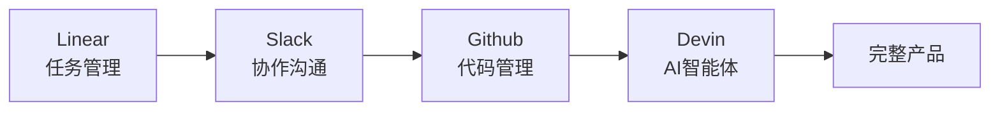

# 第4章：AI Native 实践演示

_演示模式：一个Builder如何完成一个完整产品_

---

## Slide 1: 标题页

### AI Native 实践演示

**副标题**：从想法到产品，实际操作全流程

---

## Slide 2: 演示目标

展示一个Builder通过AI协作，如何完成传统需要团队才能完成的工作

**工具链**：
- Linear（任务管理）
- Slack（协作沟通）
- Github（代码管理）
- Devin等智能体（AI协作）

---

## Slide 3: 工具链架构

---

## Slide 4: 工作流演示

### 典型的一天工作流程

1. **早上**：Linear查看任务 → 与AI讨论方案
2. **上午**：Devin协助开发核心功能
3. **下午**：代码审查 → 测试 → 部署
4. **晚上**：总结进展 → 规划明天

**关键**：Builder端到端负责，AI全程协助

---

## Slide 5: 实际案例

**产品**：一个任务管理工具
**时间**：3天（从想法到MVP）
**团队**：1个Builder + AI

**传统方式需要**：
- 产品经理 + 设计师 + 前端 + 后端 + 测试
- 时间：2-3周

---

## Slide 6: 关键启发

💡 **核心洞察**：

不是工具有多强大，而是：
1. Builder的端到端能力
2. 与AI的高效协作
3. 正确的工作流程

---

## Slide 7: 参考资源

🎧 **推荐播客**：
[小宇宙：AI Native实践案例](https://www.xiaoyuzhoufm.com/episode/68ccfa75a56ca3e0c438706c)

听听真实的Builder如何完成一个产品

---

_对应文档：[第4章：实践演示](/4-practice-demo/)_
