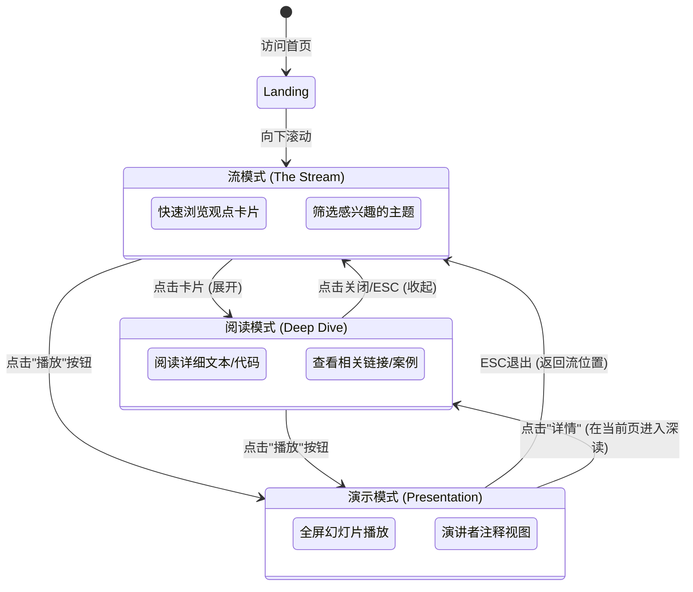

# AINative UX 设计规范

_创建时间: 2025-12-15 作者: Jett_
_生成工具: BMad Method - Create UX Design Workflow v1.0_

---

## 执行摘要

AINative 是一个双模式知识分享平台，旨在帮助个人和组织理解并实践“AI Native”理念。它通过“Builder + AI + 专业团队”的模型，从根本上重新定义了组织能力。

**项目愿景：** 创建一个平台，促进关于 AI Native 组织的“认知觉醒”，超越单纯的工具使用，转向结构性变革。

**核心价值主张：**
- **双模式交互：** 无缝切换用于分享的演示模式 (PPT) 和用于深度学习的文档模式 (Document)。
- **全员可访问：** 面向所有人，从 CEO 到个人贡献者，涵盖技术和非技术人员。
- **行动导向：** 架起概念理解与实践落地（BMAD-METHOD，工具）之间的桥梁。

**目标受众：**
- 决策层 (CEO/CTO)
- 技术执行层 (开发者)
- 非技术执行层 (产品/运营)
- 创业者/独立开发者

---

## 1. 视觉设计基础 (Visual Foundation)

### 1.1 设计主题：科技先锋 (Tech Pioneer)
- **核心关键词：** 极简 (Minimalist)、深邃 (Profound)、未来感 (Futuristic)、高对比度 (High Contrast)。
- **色彩体系 (Cyber Blue)：**
  - **背景色：** 午夜深蓝 (`#020617` / `#0f172a`)，营造深邃的沉浸感。
  - **主文本：** 纯白 (`#f8fafc`)，确保极致的可读性。
  - **强调色：** 电光蓝 (`#38bdf8`)，用于高亮核心洞察和行动点，带有微弱的发光效果 (Glow)。
  - **辅助色：** 科技灰 (`#94a3b8`)，用于次要信息。

### 1.2 布局理念：沉浸式卡片流 (Immersive Card Flow)
结合了 **沉浸式阅读** 的专注感与 **卡片流** 的模块化演示能力。
- **默认视图：** 垂直排列的“观点卡片”流，高信噪比，类似艺术画廊。
- **阅读体验：** 点击卡片展开详情，进入无干扰的深度阅读模式。
- **演示体验：** 卡片本身即是幻灯片，支持一键全屏演示。

---

## 2. 核心用户体验与旅程 (UX & Journeys)

### 2.1 交互模型
用户交互围绕三个核心状态展开，状态间通过平滑动画过渡，而非页面跳转。

### 2.2 关键用户旅程 (User Journeys)

#### 旅程 1：CEO 的认知觉醒 ( The Executive Awakening)
1.  **进入：** 打开首页，被深色背景和发光的“组织能力重构”标题吸引。
2.  **浏览：** 向下滚动，看到一系列精炼的观点卡片（如“人力堆叠 vs 算法协调”）。
3.  **演示：** 觉得内容很有价值，在会议上直接点击右上角“演示模式”，网站瞬间变成高大上的 PPT。
4.  **分享：** 演示结束，复制链接分享给 CTO。

#### 旅程 2：开发者的落地实践 (The Builder's Implementation)
1.  **进入：** 通过链接直接访问“BMAD 方法论”部分。
2.  **深读：** 点击“AI 结对编程”卡片，卡片展开，显示具体的 Prompt 模板和 Cursor 配置代码。
3.  **操作：** 复制配置代码，回到自己的 IDE 实践。
4.  **验证：** 实践成功，回到网站点击“下一步”。

---

## 3. 组件库策略 (Component Strategy)

为了支持“沉浸式卡片流”，组件系统必须高度模块化，且每个组件都要有“收起（预览）”和“展开（详情）”两种状态。

### 3.1 核心卡片类型 (Core Cards)

#### A. Hero Card (封面卡)
- **用途：** 章节或主题的开篇。
- **预览态：** 全屏宽度的背景图/渐变，超大标题，极简的副标题。视觉冲击力最强。
- **交互：** 滚动视差效果。不可展开（通常作为路标）。

#### B. Insight Card (观点卡) - *最常用*
- **用途：** 传达核心概念、金句或对比。
- **预览态：** 类似 PPT 幻灯片。左侧/上方是大字号的核心观点（如“组织能力重构”），右侧/下方是支撑性的图表或简短说明。
- **详情态：** 点击后展开，下方滑出详细的论证文本、案例分析。
- **演示模式表现：** 直接作为一张完美的幻灯片展示。

#### C. Tech Card (技术/代码卡)
- **用途：** 展示实施细节、代码、配置或工具截图。
- **预览态：** 显示代码片段的“缩略图”或工具界面的关键截图，配以标题（如“Cursor 配置”）。
- **详情态：** 展开为全功能的代码编辑器视图，支持语法高亮、复制按钮、行号。
- **交互：** 提供“一键复制”或“下载配置”的主操作按钮。

#### D. Action Card (行动卡)
- **用途：** 引导用户采取行动或检查进度。
- **预览态：** 包含一个醒目的 Checklist 或 Call-to-Action 按钮（如“开始评估”）。
- **详情态：** 展开为完整的交互式表单或分步指南。

### 3.2 导航与控制 (Navigation & Controls)

- **Floating Mode Toggle (悬浮切换球)：** 固定在屏幕右下角（或移动端顶部），用于在“文档流”和“演示模式”间随时切换。
- **Progress Rail (进度轨迹)：** 屏幕左侧或底部的细微进度条，指示当前在整个知识体系中的位置。

---

## 4. 响应式与无障碍策略 (Responsive & A11y)

### 4.1 移动端适配 (Mobile Strategy)
- **流模式优先：** 移动端默认为单列垂直流。
- **交互调整：** 
  - “点击展开”改为“点击进入新页面/模态窗”，以利用有限的屏幕空间。
  - **演示模式适配：** 在手机上，演示模式转变为“卡片滑动 (Swipe)”模式，类似 Instagram Story 或 TikTok 的翻页体验，而非传统的横屏 PPT。
- **导航：** 底部导航栏，方便拇指操作。

### 4.2 无障碍设计 (Accessibility)
- **键盘导航 (Keyboard First)：** 
  - 必须支持全键盘操作，这对 PPT 模式至关重要。
  - `Space` / `ArrowDown` / `ArrowRight`：下一张卡片。
  - `ArrowUp` / `ArrowLeft`：上一张卡片。
  - `Enter`：展开详情。
  - `Esc`：关闭详情/退出演示。
- **屏幕阅读器：** 
  - 确保卡片顺序符合逻辑 DOM 顺序。
  - 为视觉性的装饰元素添加 `aria-hidden="true"`。
  - 模式切换按钮需有明确的 `aria-label`（如 "Switch to Presentation Mode"）。
- **高对比度：** 
  - 尽管是深色模式，必须确保文本与背景的对比度至少达到 WCAG AA 标准（4.5:1）。
  - 代码块需有足够清晰的高亮配色。
